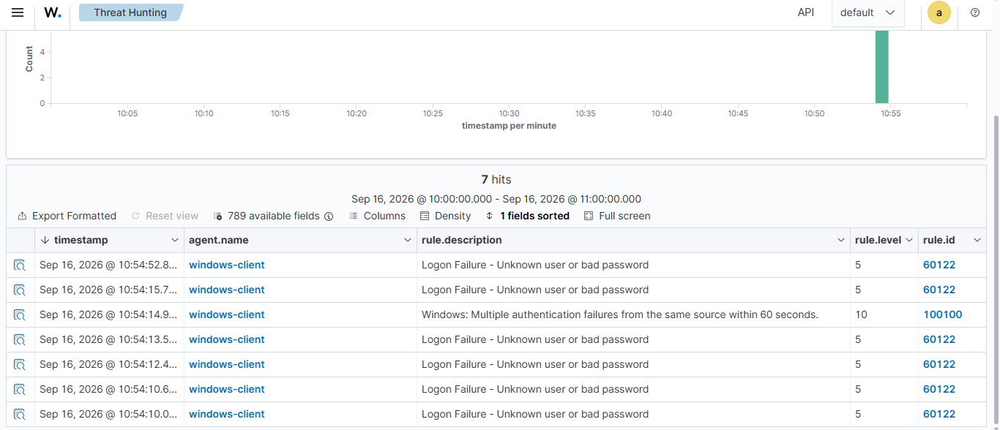
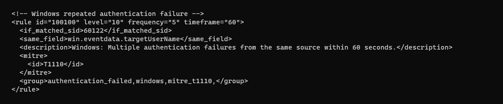
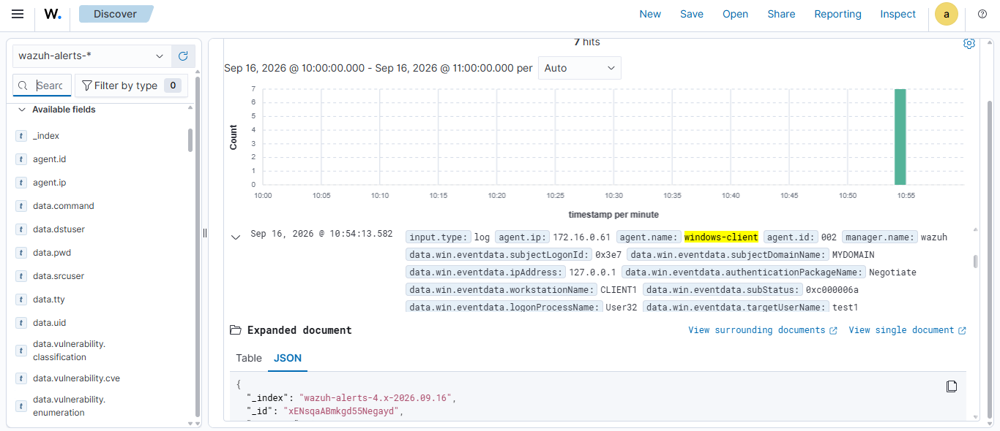
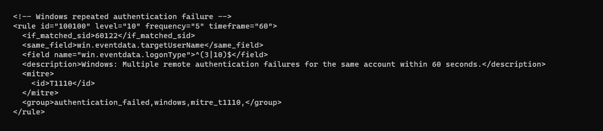

# DET-AUTH-001 — Repeated Windows Authentication Failures

## Overview

This detection was developed to identify repeated Windows authentication failures that may indicate password-guessing or brute-force activity.


---

## 1. Initial Detection

During the laboratory test, multiple Windows authentication failures were generated on **CLIENT1**.

The activity triggered custom Wazuh **Rule 100100** and was initially treated as a potential brute-force event because the configured authentication-failure threshold was reached.

### 1.1 Wazuh Alert



> **[IMAGE 1 — Wazuh Rule 100100 Alert]**

The screenshot shows the alert generated after the repeated authentication failures.

---

## 2. Initial Detection Rule

The initial rule was designed to detect:

* **5 failed authentication events**
* **Within 60 seconds**
* **For the same target account**

The rule was based on Wazuh **Rule 60122**, which identifies the underlying Windows authentication-failure events.

### 2.1 Initial Rule Screenshot


> **[IMAGE 2 — Initial Wazuh Rule]**


Rule Explanation

* **Rule Dependency (`if_matched_sid`):** The engine evaluates this custom rule based on events that have already triggered the base Wazuh rule **60122**, which identifies Windows authentication-failure events associated with **Event ID 4625**.

* **Threshold Mechanics (`frequency="5" timeframe="60"`):** The correlation logic requires a minimum of **five matching failed authentication events within a 60-second window**.

* **Target Account Tracking (`same_field`):** The rule requires the repeated events to contain the same value for `win.eventdata.targetUserName`. This ensures that failed authentication attempts against different accounts are not combined into a single correlation threshold.

* **Severity Level 10:** The rule generates a **Wazuh level 10 alert**. This represents the severity assigned to the detection and does not, by itself, confirm that a malicious attack occurred.

* **MITRE ATT&CK Mapping (`T1110`):** The detection is mapped to **T1110 — Brute Force**.


## 3. Investigation

The alert was investigated using the event details available in Wazuh.

The investigation focused on:

* Authentication time
* Target account
* Workstation
* Logon Type
* Related domain-controller activity

### 3.1 Authentication Details

The authentication failures occurred during normal working hours in the laboratory environment.

The Windows event showed:

```text
Logon Type = 2
```

Logon Type 2 represents **Interactive authentication**, indicating that the failed logins were local interactive attempts.

The event also recorded:

```text
Agent IP              = 172.16.0.61
Windows source IP     = 127.0.0.1
Workstation            = CLIENT1
Target account        = test1
```


**[IMAGE 3 — Expanded Wazuh Event 4625]**



---

## 4. False Positive Classification

The activity was classified as a **benign / false positive**.

Several factors supported this classification:

* The activity occurred during normal working hours.
* Windows recorded the source address as `127.0.0.1`.
* The event used **Logon Type 2 (Interactive)**.


The activity was classified as **benign / a false positive** because the authentication failures were associated with **Logon Type 2 (Interactive)** and the Windows event recorded the source address as `127.0.0.1`. This indicates that the login attempts were made locally on CLIENT1, which is consistent with a user trying to log in directly to the machine.

However, Logon Type 2 does not automatically mean that the activity was caused by an employee. An attacker who already has access to the machine could also generate interactive authentication failures.

For this reason, the detection was tuned to focus on **Logon Type 3 (Network)** and **Logon Type 10 (RemoteInteractive)**. These logon types are more relevant to the type of activity the detection is intended to identify because they involve network or remote authentication. Such authentication attempts can be associated with activities such as password guessing, password spraying, or lateral movement.

The tuning does not mean that Logon Types 3 and 10 are always malicious. Legitimate users, administrators, and services can also generate these logon types. Instead, the tuning reduces false positives from local interactive login attempts and makes the detection more focused on network and remote authentication activity.


## 5. Detection Tuning

The rule was configured to accept **Logon Type 3 or 10**:

| Logon Type | Meaning                 |
| ---------- | ----------------------- |
| 2          | Interactive             |
| 3          | Network                 |
| 10         | RemoteInteractive / RDP |

This excludes Logon Type 2 and keeps the detection focused on network and remote authentication.

---

## 6. Tuned Detection Rule

The final rule is:



> **[IMAGE 4 — Final tuned Wazuh rule]**


### 6.2 Authentication Filter

```xml
<field name="win.eventdata.logonType">^(3|10)$</field>
```

The regular expression matches `3` or `10` and excludes `2`.
